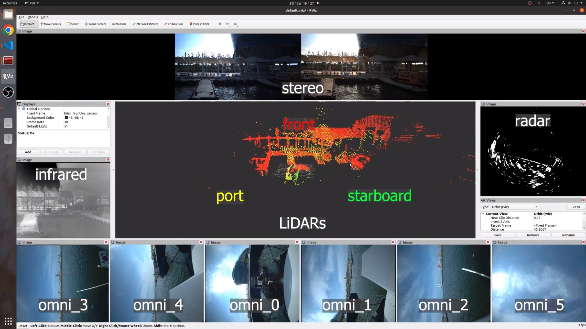
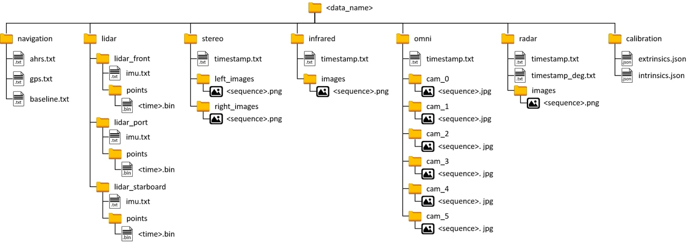

## Ros Message Player for Pohang Dataset

Example video

Select the root folder of the dataset when loading (ex: {DataSetFolder} for the tree diagram above).

Tested in ubuntu 20.04 with ROS noetic.

## Pohang Canal Dataset
Preprint of the paper: [arxiv](https://arxiv.org/abs/2303.05555).

## Acknowledgements
Inspired by IRAP file player (https://github.com/irapkaist/file_player).